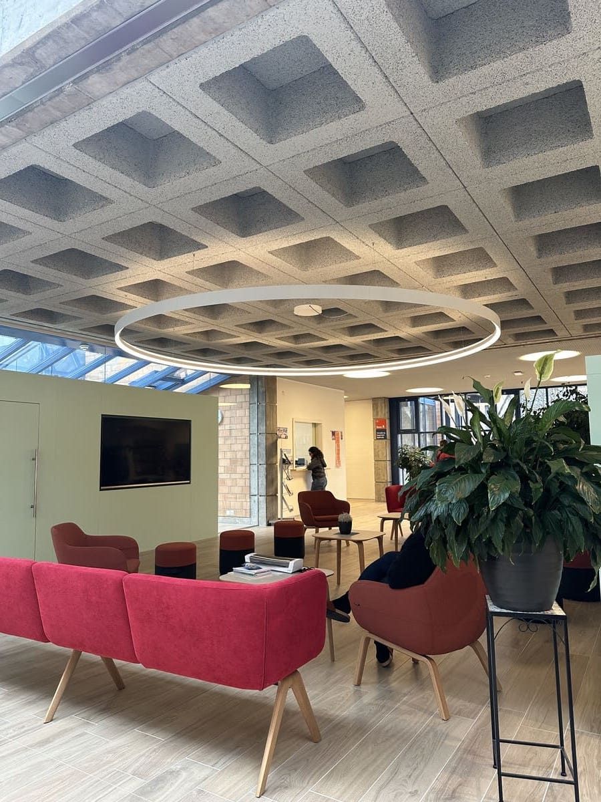
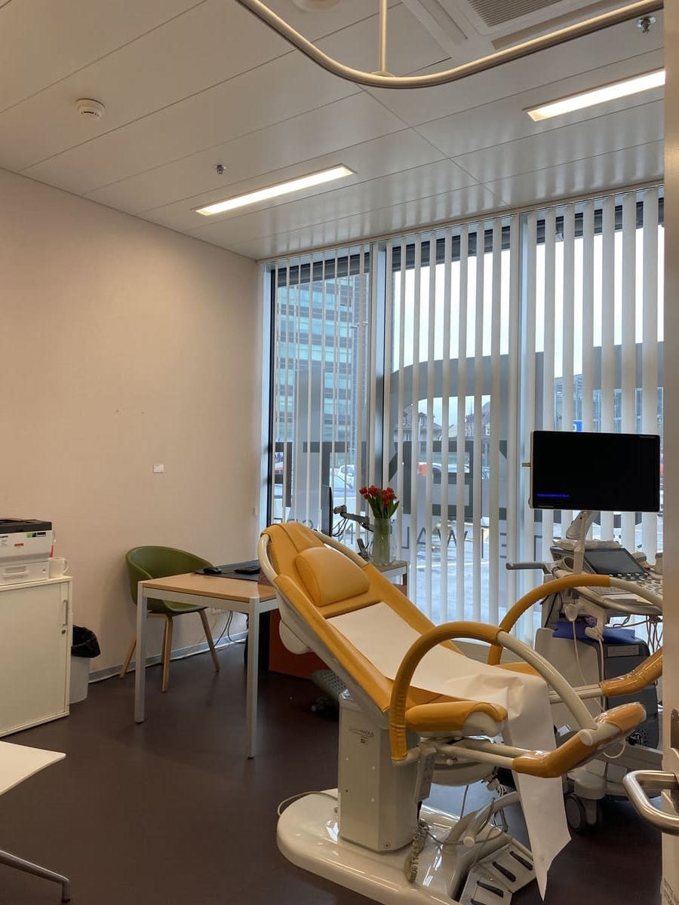

+++
title = "RrrTrisomie 21: Mehr als nur ein genetischer Zustand eine Feier der Individualität "
date = "2023-03-14"
draft = false
pinned = false
tags = []
image = ""
description = ""
footnotes = "In der Fusszeile können zum Beispiel Bildquellen angegeben werden. Dieser Text ist abgetrennt durch eine Linie und etwas kleiner."
+++
 Die genetische Störung bekannt als ,,Down Syndrom’’ kennt mittlerweile die Mehrheit der Bevölkerung. Jedoch werden die Menschen mit Trisomie 21 oft noch von der Gesellschaft ausgegrenzt.

*Eine Reportage von Célestine Pfeuti und Abseera Nanthakumar* 

Im Aufenthaltsraum des Wohnheims Acherli stehen rote, bequeme Sofas und ein mit Herzen geschmückter Baum für den Valentinstag, es herrscht eine warme Stimmung. Die Frau im Sekretariat teilt mit, dass die Interviewpartnerin gleich kommen solle. Einige Sekunden später treffen Olivier, ein Betreuer im Wohnheim, und Pia, die Interviewpartnerin und zudem Bewohnerin ein. Nach der Begrüssung geht Olivier vor und zeigt den Weg bis zum Aufzug. Im Aufzug sind alle Stöcke mit farbigen Stickern beklebt. Pia drückt auf den 2. Stock mit dem blauen Sticker drauf. ,,Pikettzimmer’’, so ist das Zimmer angeschrieben, bei dem Olivier die Tür offen hält.

### Wohnheim Acherli

Das Wohnheim Acherli, gelegen im Tscharnergut, gibt es bereits seit 30 Jahren. Es ist ein Wohnheim für die Betreuung von Menschen mit Handicap in Bern. Es bietet den Bewohnerinnen auf 12 Wohngruppen und drei Aussenwohngruppen eine auf sie abgestimmte individuelle Betreuung, Begleitung, Förderung und Beratung an. In den Wohngruppen werden alle Handicaps einzeln berücksichtigt. Beim Betreten einer Wohngruppe lässt sich ein wohliges Gefühl verspüren. Zu sehen sind eine grosse, senfgelbe Küche und eine grosse Metallwand. An der Metallwand sind Bilder der WG Bewohnerinnen zu sehen. Alles ist schön mit Stickern und Farben als Orientierungshilfe verziert. Neben den Bildern der Bewohnerinnen hängen magnetische Knöpfe, Olivier erklärt, dass man auf diese draufdrücken kann. Olivier drückt auf einen der magnetischen Knöpfe auf dem ein Bild eines Mittagessens aufgeklebt ist. Es ist eine weibliche Stimme zu hören:,, Für die Person XY gibt es heute Fleischbällchen mit Kartoffeln zum Mittagessen’’. Laut Olivier werden diese Aufnahmen jeden Tag neu aufgenommen. Für die Künstlerinnen im Wohnheim gibt es ein Atelier, in dem die Bewohner*innen die Möglichkeit haben ihre Kunstwerke auszustellen, diese werden danach an dem jährlichen Herbstmärit-Stand verkauft. Weitere Kunstwerke stellen sie jeweils in den Schaukästen auf und verkaufen diese während den Öffnungszeiten der Ateliers.

### Schauen dich Leute manchmal komisch an?:,, Ja manchmal, aber ich mach mir nichts draus''

Nach einem kurzen Rundgang im Wohnheim Acherli wird Pia im ,,Pikettzimmer’’ interviewt. Olivier erzählt, dass das Zimmer nachts für die Bewohner*innen immer zugänglich ist. ,,Es ist wie ein Nachtdienst, jedoch mit der Möglichkeit zu schlafen’’. Das Interview beginnt. Pia Magdalena Heim ist 45 Jahre alt und Künstlerin. Bevor sie ins Wohnheim Acherli kam, ging sie immer wieder zu ihren Eltern nach Hause. Als sie ins Wohnheim kam kannte sie hier schon jemanden, und zwar Olivier. Ihre beiden Eltern sind bereits verstorben. Die Mutter von Pia ist im Jahr 2022 an einer zweiten Hirnblutung gestorben und ihr Vater starb an Leukämie als sie 12 Jahre alt war. Jedoch habe sie zwei Geschwister und ihre Schwester heirate schon bald, erzählt sie stolz. Vor ein paar Jahren hat sie eine Lehre als Hauswirtschaftsangestellte begonnen. Jedoch konnte sie diese leider nicht fertig machen, da sie Diabetes Typ 1 hat. Bei Menschen mit Down-Syndrom ist die Häufigkeit von Typ-1-Diabetes dreimal so hoch wie bei Menschen ohne Down-Syndrom. Die Diagnose hinderte sie daran, Sachen zu erledigen, da ihre Zuckerwerte teilweise sehr niedrig wurden. Nun konzentriere sie sich auf die Kunst. Pia fügt an, sie habe als Kleinkind schon eine eigene Staffelei gehabt und immer wieder gerne gemalt. Sie erzählt, dass sie keinen bestimmten Malstil habe, sie zeichne einfach aus dem Kopf. Im dritten Stock angekommen zeigt Pia uns ihr Zimmer. An ihrer Zimmertür hängt ein Bild ihrer Familie. Eine wohlige Aura ist zu spüren, sehr viele warme Farben und ein Tuch über Pias Bett lassen einem wie zuhause fühlen. Pia greift unters Bett und zeigt ihre prachtvollen Kunstwerke, die genauso farbenfroh sind wie ihr Zimmer.

### Was passiert mit den Chromosomen bei Trisomie 21?

Gene enthalten den Bauplan des Menschens, sie bestimmen das Aussehen eines Lebewesens. Die Gene sind Abschnitte auf der DNA, von denen sich etwa 25.000 auf unserer DNA befinden. Gene zusammen bilden das Genom oder die Gesamtheit aller Chromosomen in einer Zelle. Ein Chromosom besteht aus zwei Chromatiden, was bedeutet, dass ein Chromatid eine aufgewickelte DNA ist. Die DNA wickelt sich um Histone (Proteine), und dieser Wicklungsprozess wiederholt sich, bis ein Chromosom entsteht. In einer menschlichen Körperzelle befinden sich 46 Chromosomen, was 23 Chromosomenpaaren entspricht. Die Hälfte der Chromosomen, also 23, werden von der Mutter und die anderen vom Vater vererbt. Das letzte Chromosomenpaar bestimmt das Geschlecht: Männliche Geschlechtszellen haben ein X-Chromosom und ein Y-Chromosom, während weibliche zwei X-Chromosomen haben.

Erst 1959 entdeckten französische Wissenschaftler, dass Menschen mit Down-Syndrom 47 Chromosomen anstelle der üblichen 46 besitzen und Chromosom 21 dreifach vorhanden ist. Dieser Fehler tritt während der Bildung von Keimzellen auf, wenn eine fehlerhafte Meiose dazu führt, dass Keimzellen das Chromosom 21 zweimal enthalten und somit 24 Chromosomen haben. Bei der Befruchtung einer solchen Keimzelle mit einer normalen entsteht ein Kind mit Trisomie 21, das 47 Chromosomen hat. Es gibt verschiedene Formen der Trisomie 21, die auftreten können. Die freie Trisomie 21 ist die häufigste und tritt bei 95% der Menschen mit Down-Syndrom auf. Daneben gibt es das Mosaik-Trisomie 21, das nur in 1-2% der Fälle vorkommt. Sehr selten ist die partielle Trisomie 21, von der weltweit 100 Fälle bekannt sind. In 3-4% der Fälle liegt eine Translokations-Trisomie 21 vor.

Die Behinderung ist häufig mit Hör- und Sehstörungen verbunden, die den Kinder Kommunikationsschwierigkeiten bereiten. Ausserdem sind Herzerkrankungen und Störungen im Verdauungstrakt nicht ungewöhnlich. In der Regel leiden Kinder unter Zöliakie und Autoimmunerkrankungen wie Typ-1-Diabetes. Ebenfalls treten häufig Infektionen in den Atemwegen auf, weil das Immunsystem unterentwickelt ist. Bei Betroffenen tritt häufiger Leukämie, eine Form von Blutkrebs, auf. Zudem sind bestimmte Muskeln im Gesicht nicht vorhanden, häufig leiden sie unter Schlafapnoe, einer wiederholten, kurzen Unterbrechung der Atmung während des Schlafens. Bei Kindern werden oftmals psychiatrische Erkrankungen diagnostiziert. Dazu gehören Hyperaktivität, Zwangsstörungen sowie Angststörungen.

#### ,,90% der Paare treiben ab, wenn sie von der Diagnose erfahren''. Wie wird es herausgefunden und wie reagieren die Eltern auf die Diagnose?

Nach einigen Minuten warten trifft Frau Aurélie Yekpe ein. Sie ist Gynäkologin (Frauenärztin) und Geburtshelferin. Sie betreut Frauen vor und nach der Schwangerschaft, sowie bei der Geburt des Kindes. Ihr Untersuchungszimmer, wo man ebenfalls Ultraschalle macht, wirkt alles sehr sauber und gut desinfiziert.

 Dr. med. Aurélie Yekpe Aurélie Yekpe ist 60 Jahre alt. Sie arbeitet im Spital Medbase am Bahnhof Bern. Nach langen hin und her hat Sie sich für die Ausbildung als Gynäkologin und Geburtshelferin entschieden. Studiert hat Frau Yekpe in drei Ländern, zuerst in der Elfenbeinküste danach noch in Österreich und in Frankreich. Als Studentin in Wien, Österreich hatte Sie nur 2 Monate Ferien, was dazu führte, dass Sie ihre Familie selten sehen konnte. Frau Yekpe hat auch ein grosses Interesse an Chirurgie für Fehlbildungen, und würde manchmal auch gerne in einer Praxis arbeiten, wo man nur fünf Patient*innen pro Tag hat. Ihr jetziger Job macht Frau Yekpe sehr viel Spass. Sie liebt es, bei Geburten dabei zu sein, da man nie wissen kann, wie das Ganze ablaufen wird. 

Frau Yekpe liest die letzte Nachricht auf ihrem Handy und ist bereit für das Interview. Sie hatte bereits Patientinnen, die ein Kind mit Down-Syndrom erwarteten. Erfahren haben die werdenden Mütter dies, indem man nach dem ersten Screening zwischen der Woche 12 und 14 einen Ultraschall gemacht hat. Dort können die ersten Anzeichen auf eine Fehlbildung gefunden werden. Danach sind auch noch Bluttests machbar zum Schauen, wie hoch das Risiko einer Trisomie 21 ist. Ab mittlerem Risiko kann noch eine weitere Untersuchung – ein NIPT Test auch Pränatal Test genannt verlangt werden. Bei dieser Untersuchung werden alle Chromosomenkarten des Kindes abgebildet. Wenn eines der Chromosomen dreifach auftritt, kann man von einem Down-Syndrom ausgehen, erklärt Frau Yekpe. Jedoch gibt es verschiedene Arten von Trisomien: die Trisomie 21, die Trisomie 13 und die Trisomie 18. Sie ist es auch, die dann der Patientin oder dem Paar mitteilen muss, dass das Kind eine Trisomie hat. Frau Yekpe erklärt:,, Wer das Screening macht, muss die Patientin oder das Paar auch über die Diagnose informieren, dies ist meine Philosophie, wer die Untersuchung vornimmt steht dann auch in der Informationspflicht’’. Es wurde auch die schwierig beantwortbare Frage gestellt, wie die Frauen auf die Diagnose reagieren. Frau Yekpe erklärt, dass zukünftige Eltern mit Kinderwunsch ein gesundes Kind vor Augen hätten und nicht die Diagnose erwarteten. Viele Betroffene können es im ersten Moment gar nicht glauben. Eine Patientin, der Frau Yekpe angerufen hat sei sofort in die Praxis gekommen, da sie es nicht wahrhaben wollte. Ihrer Meinung nach, ist der Prozentsatz der Abtreibungen so hoch, weil sich Paare kein Kind mit einer sogenannten «Beeinträchtigung» wünschen. Vorbereitet würden zukünftige Eltern auf ein Kind mit Trisomie 21 nach Möglichkeit mit psychologischer Unterstützung. Jedoch bestünden im Spital immer Kapazitätsengpässe für eine so wichtige Aufgabe, was sie persönlich bedaure.